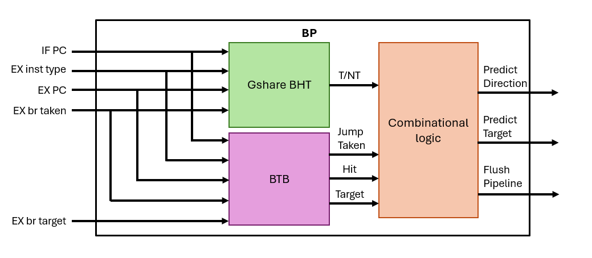

# Instruction Fetch Stage

## Branch Predictor

### Architecture

The primary role of the Branch Predictor is to anticipate whether the instruction at the current PC is a branch, and if so, whether it will be taken and to which target address. In the IF stage, the CPU relies on the prediction to determine the next fetch address, while in the EX stage the actual branch outcome is resolved and compared against the prediction. If a misprediction occurs, the **Branch History Table (BHT)** must be updated and the pipeline (e.g., IF/ID and ID/EX) flushed to remove incorrect instructions, ensuring correct program execution.

### Module Breakdown

- `Fetch.v`:Evaluate if the instruction at the EX stage requires updating the BHT or BTB.
    - `BP_top.v`:Top-level BP module that controls all submodules.
        - `gshare_bht.v`:Fuse the information from the PC and GHR to locate or update the corresponding prediction state.
        - `btb.v`:Use the PC as the index to locate or update the corresponding target.

### Design Rationale

The **Branch History Table (BHT)** and **Branch Target Buffer (BTB)** complement each other in branch prediction.

- **Branch History Table:** The BHT is a table that records the recent behavior of branch instructions, typically using one or more bits per entry to track whether a branch was taken or not. When the CPU fetches an instruction, the PC is used to index into the BHT, and the stored value provides a prediction about whether the branch will be taken. This prediction guides the Instruction Fetch stage to select the next PC. After the actual outcome of the branch is resolved in the Execute stage, the corresponding BHT entry is updated to reflect the new branch behavior, enabling the predictor to learn from past execution history.
    - **2-bit BHT:** To improve stability, each entry uses a 2-bit saturating counter instead of a single bit. The counter changes state only after two consecutive mispredictions, making the predictor less sensitive to occasional deviations.
    - **GHR:** While 2-bit BHT only consider the behavior of one branch, many programs have correlated branches (e.g., the outcome of one branch depends on a previous one). The GHR stores the outcomes of the most recent branches as a shift register. This global history can then be combined with the PC to form a more informed prediction.
    - **Gshare:** A widely used predictor that combines the PC bits and the GHR by XORing them to form the index into the BHT. This spreads different history patterns across the table, reducing aliasing. In our implementation, we observed that when the BHT size is increased to 2^11 entries (index_bits = 11), using a 4-bit GHR yields the highest prediction accuracy.
- **Branch Target Buffer:** The BTB is a cache-like structure that stores the target addresses of branch and jump instructions. In the IF stage, the CPU queries the BTB using the current PC. If a hit occurs, the BTB supplies the corresponding branch target, allowing the CPU to determine the next PC immediately during instruction fetch, without waiting for resolution in the EX stage.

The BHT predicts whether a branch will be taken or not, while the BTB provides the corresponding target address if the branch is taken. Together, they enable the Instruction Fetch stage to quickly decide both whether to jump and where to jump. The BHT ensures prediction accuracy in control flow direction, and the BTB reduces penalty by supplying the next PC without waiting for execution. This synergy minimizes control hazards and improves overall pipeline efficiency.

### Functional Breakdown

- **XOR between PC and GHR:** In a Gshare predictor, selected bits of the Program Counter (PC), typically the lower bits, are XORed with the Global History Register (GHR) to form the index into the Branch History Table (BHT). The primary purpose of this XOR operation is to reduce aliasing—the situation where multiple unrelated branches map to the same BHT entry.
- **Target selection based on BHT state and BTB hit:** After performing the XOR of the PC and GHR and accessing the table, the predictor retrieves a saturating counter state from the BHT entry. This state is ORed with the “is-jump” bit recorded in the BTB to determine whether the branch is predicted as taken.
    - If the prediction is taken and the BTB tag hits, the corresponding target address is fetched from the BTB and used as the next PC.
    - If the prediction is not taken or the BTB does not hit, the PC is updated to PC+4 to continue sequential fetching.
- **Misprediction detection in the EX stage:** Only branch and jump instructions are subject to branch prediction validation. At the EX stage, if the prediction result differs from the actual execution outcome, a misprediction is detected.
    - When a misprediction occurs, the CPU generates a flush signal to invalidate the incorrect instructions in the pipeline, and in the next cycle, the PC is redirected either to the correct branch target or to PC+4.
- **Target selection upon misprediction in the EX stage:** Based on the actual evaluation in the EX stage:
    - If taken, the PC is updated to the target address computed in the EX stage.
    - If not taken, the PC is updated to PC+4 to continue sequential execution.
