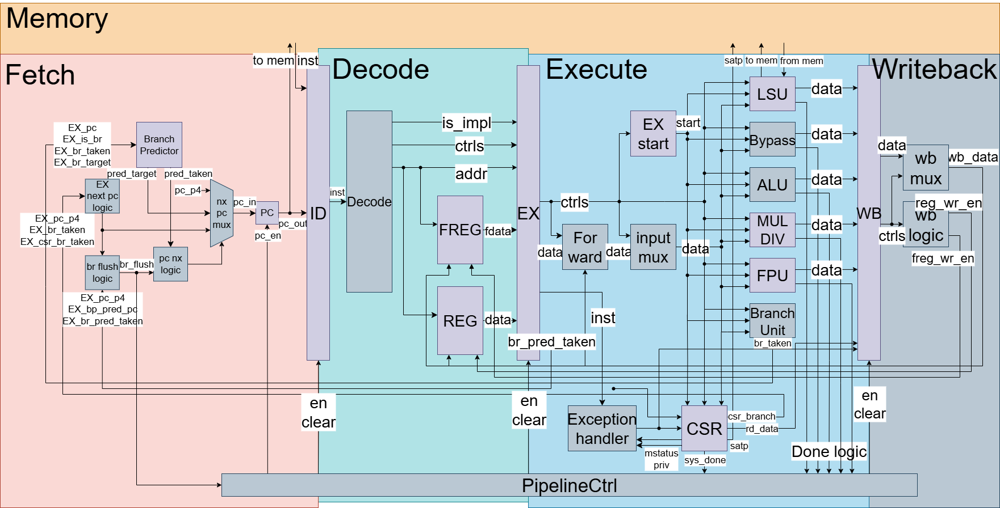

.. RISCV32 Core Docs documentation master file, created by
   sphinx-quickstart on Tue Aug 12 11:43:50 2025.
   You can adapt this file completely to your liking, but it should at least
   contain the root `toctree` directive.

NYCU RISCV32 Core Documentation
===============================

Here is the block diagram of the core:

.. toctree::
   :maxdepth: 2
   :caption: Contents:

   core_design_index.rst
