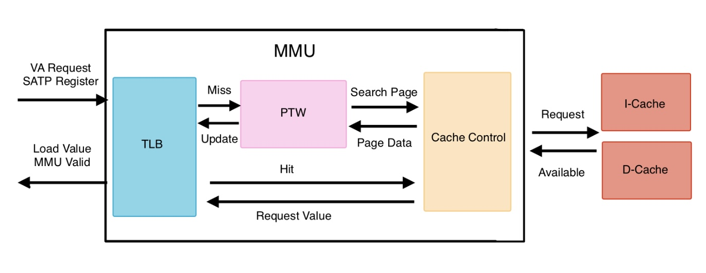

# Memory Stage

## LSU (Load Store Unit)

In RISC-V core, the Load Store Unit (LSU) is a critical pipeline component responsible for controlling load and store instructions and handling various error conditions, particularly address misalignment. The LSU acts as an interface between the processor's execution stage and the Memory Management Unit (MMU), ensuring proper data transfer, address calculation, and exception handling.

- **LSU Queue:** The `LSU` implement internal queue to store all necessary dtat for memory operactions.
- **Address Misaligned:** In this part, we want LSU detect misaligned error and solve it. Therefore, we need to record every condition, including memory addresses, data values, instruction types, and control signals.
- **Writeback Data Calculation:** This part is for load instruction. In our design, lsu will sent read word signal to mmu even if instruction is `WB` or `WH`. Therefore, it needs caculate word data after lsu get terget data.

### Implement Detail

#### Parameter

|Parameter  |Description                            |
|-----------|---------------------------------------|
|LENGTH     |Queue length parameter                 |
|DEPTH      |Queue depth parameter                  |
|DATASIZE   |Internal data size for queue operations|

#### Address and Data Procressing

**Address:** LSU will control address which will be sent into MMU be mutiple of 4.
**Data:** LSU use `mask` to control which byte of write data are needed to be writen into memory.

#### LSU Queue

Queue store data which generate according to input opcode and singal.

- Push: input instruction is valid, and misaligned condition.
- Pop: when memory return finished signal.

Store Data:

|Signal                     |Width |Description            |
|---------------------------|------|-----------------------|
|mem_addr                   |32    |Target memory address  |
|mem_data                   |32    |value of write data    |
|lb_inst, lh_inst, lw_inst  |1     |Load instruction type|
|signed_inst                |1     |load instruction is signed |
|mem_rd, mem_wr             |1     |memory read and write signal|
|mem_mask                   |4     |store or load mask|
|u_type                     |1     |additional instruction for misaligned problem|

#### Address Misaligned

The LSU includes sophisticated misalignment detection and correction logic. When misaligned memory accesses are detected, the LSU automatically:

- Splits the misaligned access into multiple aligned memory transactions
- Maintains state information across multiple memory cycles
- Reconstructs the final result from partial memory responses
- Ensures atomicity of the original memory operation from an architectural perspective

The LSU handles unaligned memory accesses by splitting them into multiple aligned accesses:

- **Unaligned Detection**
    - Half-word unaligned: Address bits [1:0] = 2'b11
    - Word unaligned: Address bits [1:0] ≠ 2'b00

- **Unaligned Access Handling:** Maintains state machine (u_state) for multi-cycle unaligned operations. Then, automatically generates second memory access for unaligned transfers.Finally, reconstructs data from multiple memory responses in writeback calculation.

#### Writeback Value Calculation

For load instructions, the LSU performs intelligent data processing since it always requests full 32-bit words from the MMU regardless of the actual load instruction type (LB, LH, LW). The writeback calculation unit:

Extracts the relevant bytes from the loaded word based on address and instruction type
Performs sign extension or zero extension as required
Handles data reconstruction for misaligned accesses
Manages the timing of writeback operations to the register file

#### Exception Handling

In this part, LSU will receive signal `load_fault` and `store_fault` which is sended from MMU. Then, LSU will generate exception signal with current load or store instruction.

## MMU (Memory Management Unit)

In RISC-V core architectures, the Memory Management Unit (MMU) serves as a critical component responsible for translating virtual addresses into physical addresses. Beyond basic address translation, the MMU provides essential security and reliability features through comprehensive error detection mechanisms, including address range validation and page accessibility verification. Our MMU design implements a three-tier architecture comprising specialized units that work in concert to deliver efficient virtual memory management:

### Architecture

Modules:

- `mmu_tlb.v` : TLB store a history data of pages. It returns value if page was requested, or sent request signal into TLB to find correct page and its data.
- `mmu_ptw.v` : PTW can find the correct page with page index of virtual address and calculate physical address by page data. Then, page fault exceptions also are detected in this unit.
- `mmu_cache_control.v` : cache control is interface for Dcache and Icache. It receives available signal from cache and sents control signal such as valid signal to control MMU current request is finished.

### Implement Detail

#### TLB

Use two register to store page value, and it compares input virtual page number and `vpn_q`. If TLB hit, TLB will return page value directly. Otherwise, MMU will start PTW to find target page and update TLB data.

|Register   |Width  |Description        |
|-----------|-------|-------------------|
|vpn_q      |20     |virtual page number|
|entry_q    |32     |page entry data    |

#### PTW

Page table walker (PTW) can search page table and detect page errror condition. In our virtual address design, we use two level page to translate virtual address into physical address. Therefore, PTW use four state finite state machine to control procession of searching page. Four state include:

|State          |Description                 |
|---------------|----------------------------|
|IDLE           |wait MMU start PTW          |
|FIRST_LEVEL    |search first level page     |
|SECOND_LEVEL   |search second level page    |
|UPDATE         |get page data and update TLB|

### Virtual Memory (Sv32)

We use **Sv32** as our virtual address design. Sv32 use two-level page to translate virtual address into physical address. This is its **virtual address structure:**

|31 - 22               |21 - 12                |11 - 0|
|----------------------|-----------------------|------|
|First Level Page Index|Second Level Page Index|Offset|

**Page Table Structure:**

| Bit Position | Macro Name | Description |
|--------------|------------|-------------|
|0 | PRESENT | Page is valid in memory |
|1 | READ | Page has read permission |
|2 | WRITE | Page has write permission |
|3 | EXEC | Page has execute permission |
|4 | USER | Page is accessible in user mode |
|5 | GLOBAL | Page is global (not flushed on context switch) |
|6 | ACCESSED | Page has been accessed |
|7 | DIRTY | Page has been modified |
|9:8| SOFT | Software-defined bits (2 bits) |
|29:10|ENTRY| Physical page number|

**SATP (Supervisor Address Translation and Protection):** It is a register to store virtual address information and control page management, and it maintain by `CSR`. This is Satp structure:

|31     |30 - 22    |19 - 0 |
|-------|-----------|-------|
|MODE   |ASID       |PPN    |

- MODE: virtual address support in current.
- ASID: address space identifier to control that address can be used in current process.
- PPN: first level physical page number.

## Dcache

### 1. I/O port

#### System Ports

| I/O    | name                 | width | purpose                        |
|--------|--------------------|-------|--------------------------------|
| input  | clk                 | 1     | Timing                         |
| input  | rst_n               | 1     | Reset dcache at low            |
| input  | mem_init_complete_i | 1     | Inform cache if DRAM is working|

#### CPU Ports

| I/O    | name         | width | purpose                                                                 |
|--------|-------------|-------|-------------------------------------------------------------------------|
| input  | tag_i        | 18    | A number to recognize whether the data we want is on the specific address or not |
| input  | idx_i        | 9     | To address which cache line we want                                     |
| input  | word_ofs_i   | 3     | Operating a specific word in a specific data block                      |
| input  | mask_i       | 4     | A word is 4 bytes in 32-bit CPU and mask_i is a filter to choose which bytes need to be operated |
| input  | cpu_req_wr   | 1     | CPU wants to write data to cache                                        |
| input  | cpu_req_rd   | 1     | CPU wants to read data from cache                                       |
| output | cpu_data_o   | 32    | Turn specific data back to CPU                                          |
| output | dcache_rdy_o | 1     | A one way handshake telling CPU if this cache is available or not       |
| input  | invalidate_i | 1     | Invalidate specific cacheline                                           |
| input  | flush_i      | 1     | Flush specific cacheline                                                |
| input  | writeback_i  | 1     | Write all of the data back to DRAM                                      |

#### Arbiter Ports

| I/O    | name         | width | purpose                                                             |
|--------|-------------|-------|---------------------------------------------------------------------|
| input  | mem_rdy_i    | 1     | A handshake signal to inform cache if it can send new instruction to arbiter |
| input  | mem_data_i   | 256   | Data from arbiter (DRAM)                                           |
| output | wr_mem_end_o | 1     | Get high when the data is last one                                  |
| input  | rd_mem_end_i | 1     | Tell cache reading process is done                                  |
| output | req_wr_mem   | 1     | Cache requests to write data to memory                               |
| output | req_rd_mem   | 1     | Cache requests to read data from memory                               |
| output | mem_addr_o   | 32    | Tell DRAM which address cache wants to write or read                |
| output | mem_data_o   | 256   | Data for DRAM                                                        |

### 2. Description

This is a 32kB 2-way cache. Its data storage is constructed by BRAM IP, and each block size is 32 bits. It uses LRU as the replacement policy when a data miss occurs.

## Icache

### 1. I/O ports

#### System Ports

| I/O    | name                 | width | purpose                        |
|--------|--------------------|-------|--------------------------------|
| input  | clk                 | 1     | Timing                         |
| input  | rst_n               | 1     | Reset dcache at low            |
| input  | mem_init_complete_i | 1     | Inform cache if DRAM is working|

#### CPU Ports

| I/O    | name         | width | purpose                                                                 |
|--------|-------------|-------|-------------------------------------------------------------------------|
| input  | tag_i        | 19    | A number to recognize whether the data we want is on the specific address or not |
| input  | idx_i        | 8     | To address which cache line we want                                     |
| input  | ofs_i        | 5     | Operating a specific word in a specific data block (The last two bits must be zero) |
| input  | invalidate_i | 1     | Invalidate specific cacheline                                           |
| output | icache_rdy_o | 1     | Tell CPU if I-cache is available                                        |
| output | cpu_inst_o   | 32    | Output particular instruction                                           |

#### Arbiter Ports

| I/O    | name         | width | purpose                                                             |
|--------|-------------|-------|---------------------------------------------------------------------|
| input  | mem_rdy_i    | 1     | A handshake signal to inform cache if it can send new instruction to arbiter |
| input  | mem_data_i   | 256   | Data from arbiter (DRAM)                                           |
| input  | rd_mem_end_i | 1     | Tell cache reading process is done                                  |
| output | req_rd_mem_o | 1     | Cache requests to read data from memory                               |
| output | mem_addr_o   | 32    | Tell DRAM which address cache wants to write or read                |

### 2. Description

This is a 16kB 2-way cache. Its data storage is constructed by BRAM IP, and each block size is 32 bits. It uses FIFO as the replacement policy when a data miss occurs.

## Arbiter

### 1. I/O Ports

#### System Ports

| I/O    | name          | width | purpose                   |
|--------|---------------|-------|---------------------------|
| input  | clk           | 1     | Timing                    |
| input  | rst_n         | 1     | Reset caches at low       |
| input  | init_addr_i   | 32    | Provide DRAM initial values |
| input  | init_data_i   | 128   | Initial values            |
| input  | init_end_i    | 1     | Initialization is done    |

#### Dcache Ports

| I/O    | name       | width | purpose                        |
|--------|------------|-------|--------------------------------|
| output | d_rd_data_o | 256  | Data Dcache needs             |
| output | d_rd_end_o  | 1    | Read data process is done      |
| input  | d_wr_data_i | 256  | Data to store into DRAM        |
| input  | d_req_wr_i  | 1    | Dcache requests to write to DRAM |
| input  | d_req_rd_i  | 1    | Dcache requests to read from DRAM |
| input  | d_addr_i    | 32   | Address for DRAM write/read    |
| output | d_mem_rdy_o | 1    | Dcache can start to read/write DRAM |

#### Icache Ports

| I/O    | name       | width | purpose                        |
|--------|------------|-------|--------------------------------|
| output | i_rd_data_o | 256  | Data Icache needs             |
| output | i_rd_end_o  | 1    | Read data process is done      |
| input  | i_req_rd_i  | 1    | Icache requests to read from DRAM |
| input  | i_addr_i    | 32   | Address for DRAM write/read    |
| output | i_mem_rdy_o | 1    | Icache can start to read/write DRAM |

#### MIG Ports

| I/O    | name           | width | purpose                                      |
|--------|----------------|-------|----------------------------------------------|
| output | app_addr       | 27    | DRAM address (128MB DRAM → 27 bits)         |
| output | app_cmd        | 1     | Decide read or write                          |
| output | app_en         | 1     | Command enable                                |
| input  | app_rdy        | 32    | MIG is ready to accept new command           |
| input  | init_mem_rdy   | 1     | High after DRAM starts working               |
| output | app_wdf_data   | 128   | Data to write into DRAM                        |
| output | app_wdf_end    | 1     | High for 1 cycle at end of data             |
| output | app_wdf_wren   | 1     | Write command valid                           |
| input  | app_wdf_rdy    | 1     | DRAM can accept write                         |
| output | app_wdf_mask   | 1     | Which bytes to write (default: all zeros)    |
| input  | app_rd_data    | 128   | Data from DRAM                                |
| input  | app_rd_data_end| 1     | High when data read back from DRAM           |
| input  | app_rd_data_valid | 1  | Handshake indicating data from DRAM is valid |

### 2. Description

This interface resolves competition between I-cache and D-cache and also serves as a data channel when the CPU is first activated(Current version).

## Native MIG

### 1. I/O Ports

#### DDR2 Ports

Skip them, this part will automatically operate by MIG IP after a command is issued to MIG, so we don't need to pay much time on relizing port of DDR2. That is, we don't need to operate this part in person.

#### Application Interface Ports

| I/O    | name                 | width | purpose                                       |
| ------ | -------------------- | ----- | --------------------------------------------- |
| input | app_addr            | 27    | DRAM address for read/write (128MB → 27 bits) |
| input | app_cmd             | 3     | Command type (read when 3'b000/write when 3'b001)               |
| input | app_en              | 1     | Command enable (the command at app_cmd should be adapted)                                |
| input  | app_wdf_data       | 128   | Data need to be written to DRAM(the width is limited by DDR)                         |
| input  | app_wdf_end        | 1     | High for the end of Data sequence           |
| input  | app_wdf_wren       | 1     | Write Command enable(Both app_en and app_wdf_wren get high when writing )                           |
| input  | app_sr_req         | 1     | Request self-refresh (Not that much important, just set 1'b0 is fine)                      |
| input  | app_ref_req        | 1     | Request refresh (Not that much important, just set 1'b0 is fine)                           |
| input  | app_zq_req         | 1     | Request ZQ calibration (Not that much important, just set 1'b0 is fine)                    |
| input  | app_wdf_mask       | 16    | Byte mask for write data (1 = ignore byte, generality setting to 16'h0) |
| output | app_rd_data        | 128   | Data read from DRAM                        |
| output | app_rd_data_end   | 1     | High when last beat of read data           |
| output | app_rd_data_valid | 1     | Read data valid handshake                  |
| output | app_rdy             | 1     | MIG ready to accept new command            |
| output | app_wdf_rdy        | 1     | Ready to accept new writting command                 |
| output | app_sr_active      | 1     | Self-refresh active (Not that much important)     |
| output | app_ref_ack        | 1     | Refresh acknowledge(Not that much important)                        |
| output | app_zq_ack         | 1     | ZQ calibration acknowledge(Not that much important)|
| output | ui_clk              | 1     | User interface clock, this clock will automatically generated by MIG after setting up the behavior of MIG IP |
| output | ui_clk_sync_rst   | 1     | Reset synchronized to user clock(Not that much important) |

#### System Ports
| I/O   | name        | width | purpose                  |
| ----- | ----------- | ----- | ------------------------ |
| input | sys_clk_i | 1     | System clock (on the Digilent Nexys A7-100T, recommended period = 3077 ps)     |
| input | clk_ref_i | 1     | Reference clock input, depends on MIG IP setup  |
| input | sys_rst    | 1     | Active-low reset (depends on your decision during MIG IP setup) |

### 2. Discription
The behavior of the MIG is determined by the FPGA board that you use.

### 3. The parameters in Digilent-NEXYS A7 100T board
<1>Pin Compatible FPGA->採用預設值
<2>Memory Selection->選DDR2 SDRAM
<3>Controller Options->clock Period官方推薦3077ps，PHY在3077ps下只能是4:1，Memory Part在這塊版上是MT47H64M16HR-25E，對應的Data width是16 bits，Data Mask要勾選，其餘選項皆採預設
<4>Memory Options->Input Clock Period選3077ps，Burst Type選Sequence，RTT-ODT選50ohms，Memory Address Mapping Selection選Bank-ROW-COLLUM這個順序
<5>FPGA Options->System Clock選Single-Ended，Reference Clock選No Buffer,其餘選項皆採預設值
Extended FPGA OPtions->Internal Termination Impedence選50Ohms
<6>IO Planning Options->選Fixed Pin output
<7>Pin Selection->做腳位配置
<8>後續全按NEXT
