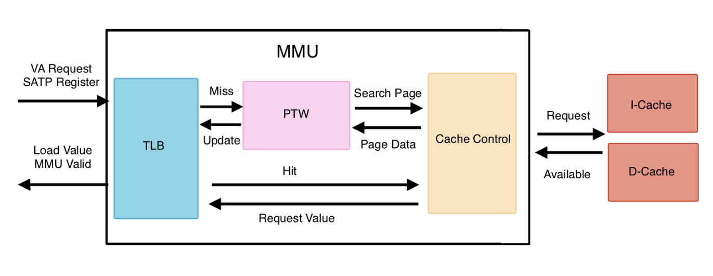

# Memory Stage

## LSU (Load Store Unit)

In RISC-V core, the Load Store Unit (LSU) is a critical pipeline component responsible for controlling load and store instructions and handling various error conditions, particularly address misalignment. The LSU acts as an interface between the processor's execution stage and the Memory Management Unit (MMU), ensuring proper data transfer, address calculation, and exception handling.

- **LSU Queue:** The `LSU` implement internal queue to store all necessary dtat for memory operactions.
- **Address Misaligned:** In this part, we want LSU detect misaligned error and solve it. Therefore, we need to record every condition, including memory addresses, data values, instruction types, and control signals.
- **Writeback Data Calculation:** This part is for load instruction. In our design, lsu will sent read word signal to mmu even if instruction is `WB` or `WH`. Therefore, it needs caculate word data after lsu get terget data.

### Implement Detail

#### Parameter

|Parameter  |Description                            |
|-----------|---------------------------------------|
|LENGTH     |Queue length parameter                 |
|DEPTH      |Queue depth parameter                  |
|DATASIZE   |Internal data size for queue operations|

#### Address and Data Procressing

**Address:** LSU will control address which will be sent into MMU be mutiple of 4.
**Data:** LSU use `mask` to control which byte of write data are needed to be writen into memory.

#### LSU Queue

Queue store data which generate according to input opcode and singal.

- Push: input instruction is valid, and misaligned condition.
- Pop: when memory return finished signal.

Store Data:

|Signal                     |Width |Description            |
|---------------------------|------|-----------------------|
|mem_addr                   |32    |Target memory address  |
|mem_data                   |32    |value of write data    |
|lb_inst, lh_inst, lw_inst  |1     |Load instruction type|
|signed_inst                |1     |load instruction is signed |
|mem_rd, mem_wr             |1     |memory read and write signal|
|mem_mask                   |4     |store or load mask|
|u_type                     |1     |additional instruction for misaligned problem|

#### Address Misaligned

The LSU includes sophisticated misalignment detection and correction logic. When misaligned memory accesses are detected, the LSU automatically:

- Splits the misaligned access into multiple aligned memory transactions
- Maintains state information across multiple memory cycles
- Reconstructs the final result from partial memory responses
- Ensures atomicity of the original memory operation from an architectural perspective

The LSU handles unaligned memory accesses by splitting them into multiple aligned accesses:

- **Unaligned Detection**
    - Half-word unaligned: Address bits [1:0] = 2'b11
    - Word unaligned: Address bits [1:0] ≠ 2'b00

- **Unaligned Access Handling:** Maintains state machine (u_state) for multi-cycle unaligned operations. Then, automatically generates second memory access for unaligned transfers.Finally, reconstructs data from multiple memory responses in writeback calculation.

#### Writeback Value Calculation

For load instructions, the LSU performs intelligent data processing since it always requests full 32-bit words from the MMU regardless of the actual load instruction type (LB, LH, LW). The writeback calculation unit:

Extracts the relevant bytes from the loaded word based on address and instruction type
Performs sign extension or zero extension as required
Handles data reconstruction for misaligned accesses
Manages the timing of writeback operations to the register file

#### Exception Handling

In this part, LSU will receive signal `load_fault` and `store_fault` which is sended from MMU. Then, LSU will generate exception signal with current load or store instruction.

## MMU (Memory Management Unit)

In RISC-V core architectures, the Memory Management Unit (MMU) serves as a critical component responsible for translating virtual addresses into physical addresses. Beyond basic address translation, the MMU provides essential security and reliability features through comprehensive error detection mechanisms, including address range validation and page accessibility verification. Our MMU design implements a three-tier architecture comprising specialized units that work in concert to deliver efficient virtual memory management:

### Architecture

Modules:

- `mmu_tlb.v` : TLB store a history data of pages. It returns value if page was requested, or sent request signal into TLB to find correct page and its data.
- `mmu_ptw.v` : PTW can find the correct page with page index of virtual address and calculate physical address by page data. Then, page fault exceptions also are detected in this unit.
- `mmu_cache_control.v` : cache control is interface for Dcache and Icache. It receives available signal from cache and sents control signal such as valid signal to control MMU current request is finished.

### Implement Detail

#### TLB

Use two register to store page value, and it compares input virtual page number and `vpn_q`. If TLB hit, TLB will return page value directly. Otherwise, MMU will start PTW to find target page and update TLB data.

|Register   |Width  |Description        |
|-----------|-------|-------------------|
|vpn_q      |20     |virtual page number|
|entry_q    |32     |page entry data    |

#### PTW

Page table walker (PTW) can search page table and detect page errror condition. In our virtual address design, we use two level page to translate virtual address into physical address. Therefore, PTW use four state finite state machine to control procession of searching page. Four state include:

|State          |Description                 |
|---------------|----------------------------|
|IDLE           |wait MMU start PTW          |
|FIRST_LEVEL    |search first level page     |
|SECOND_LEVEL   |search second level page    |
|UPDATE         |get page data and update TLB|

### Virtual Memory (Sv32)

We use **Sv32** as our virtual address design. Sv32 use two-level page to translate virtual address into physical address. This is its **virtual address structure:**

|31 - 22               |21 - 12                |11 - 0|
|----------------------|-----------------------|------|
|First Level Page Index|Second Level Page Index|Offset|

**Page Table Structure:**

| Bit Position | Macro Name | Description |
|--------------|------------|-------------|
|0 | PRESENT | Page is valid in memory |
|1 | READ | Page has read permission |
|2 | WRITE | Page has write permission |
|3 | EXEC | Page has execute permission |
|4 | USER | Page is accessible in user mode |
|5 | GLOBAL | Page is global (not flushed on context switch) |
|6 | ACCESSED | Page has been accessed |
|7 | DIRTY | Page has been modified |
|9:8| SOFT | Software-defined bits (2 bits) |
|29:10|ENTRY| Physical page number|

**SATP (Supervisor Address Translation and Protection):** It is a register to store virtual address information and control page management, and it maintain by `CSR`. This is Satp structure:

|31     |30 - 22    |19 - 0 |
|-------|-----------|-------|
|MODE   |ASID       |PPN    |

- MODE: virtual address support in current.
- ASID: address space identifier to control that address can be used in current process.
- PPN: first level physical page number.

## Memory system
The simplified structure of the Memory system is below.

### Dcache

#### 1. I/O port

##### System Ports

| I/O    | name                 | width | purpose                        |
|--------|--------------------|-------|--------------------------------|
| input  | clk                 | 1     | Timing                         |
| input  | rst_n               | 1     | Reset dcache at low            |

##### CPU Ports

| I/O    | name         | width | purpose                                                                 |
|--------|-------------|-------|-------------------------------------------------------------------------|
| input  | tag_i        | 18    | A number to recognize whether the data we want is on the specific address or not |
| input  | idx_i        | 9     | To address which cache line we want                                     |
| input  | word_ofs_i   | 3     | Operating a specific word in a specific data block                      |
| input | cpu_data_i   | 32    | The data CPU wants to store                                         |
| input  | mask_i       | 4     | A word is 4 bytes in 32-bit CPU and mask_i is a filter to choose which bytes need to be operated |
| input  | cpu_req_wr   | 1     | CPU wants to write data to cache                                        |
| input  | cpu_req_rd   | 1     | CPU wants to read data from cache                                       |
| output | cpu_data_o   | 32    | The data CPU wants to load                                         |
| output | dcache_rdy_o | 1     | A handshake telling CPU if this cache is available or not       |
| output | exception | 1     |  This signal keep high until the CPU sends except_complete if dcache tries to read/write but fail  |
| input  | except_complete   | 1     | Asserted for one cycle after the CPU handles an exception caused by the dcache  |

##### MMU Ports
| input  | flush_i      | 1     | Flush specific cacheline                                                |
| input  | writeback_i  | 1     | Write all of the data back to DRAM                                      |
| input  | invalidate_i | 1     | Invalidate specific cacheline                                           |

##### MEM Ports
###### Commen signal
| I/O    | name         | width | purpose                                                             |
|--------|-------------|-------|---------------------------------------------------------------------|
| output  | mem_addr    | 32     | The address being read from or written to by the dcache |

###### READ Channel 
| I/O    | name         | width | purpose                                                             |
|--------|-------------|-------|---------------------------------------------------------------------|
| input  | rm_rdy    | 1     | Asserted by memory to notify the cache that it is ready to accept a new read request  |
| input  | rm_data   | 256   | The data reads back from memory                                           |
| input |  rm_success | 1     | The result of read memory is successful                                  |
| input  | rm_complete | 1     | Indicates that the memory read operation has completed                 |
| output | rm_vld   | 1     | Asserted when the dcache issues a read request to memory        |

###### WRITE Channel 
| I/O    | name         | width | purpose                                                             |
|--------|-------------|-------|---------------------------------------------------------------------|
| input  | wm_rdy    | 1     | Asserted by memory to notify the cache that it is ready to accept a new write request  |
| output  | wm_data   | 256   | The data being written to memory by the dcache               |
| output | wm_vld   | 1     | Asserted when the dcache issues a write request to memory        |

###### WRITE RESPONSE Channel 
| I/O    | name         | width | purpose                                                             |
|--------|-------------|-------|---------------------------------------------------------------------|
| input  | wm_success    | 1    | Asserted by slave memory to inform the cache that the write request has been accepted |
| input  | wm_complete   | 1   |  Indicates that the memory write operation has completed |

#### 2. Description
##### Structure Introduction
This is a two-way set-associative data cache with an LRU replacement policy and a write-back strategy.
Each way contains 512 cache lines, and each cache line has a block size of 32 bytes, resulting in a total data size of 32 KB.

Data blocks are implemented using BRAMs, which naturally introduce one-cycle read latency.
To maintain the cache as a single-cycle pipelined stage from the CPU’s perspective,
the tag, valid, and dirty arrays are implemented in LUTs.
This allows hit/miss detection to be performed in the same cycle as the BRAM read address is issued,
so that the controller can prepare the next operation or replacement decision one cycle earlier.

Although the ready signal and the returned data are both asserted after one cycle, 
the early availability of hit/miss information effectively reduces control-path latency and simplifies FSM design, 
since the replacement and write-back logic can be pre-triggered without additional stalls.

##### Hit Behavior
As mentioned above, the CPU observes a one-cycle latency between issuing a read or write request and receiving the result.

##### Miss Behavior
Since the data cache determines a miss condition in advance, the miss-handling process can start immediately on the next clock cycle.

Although AXI4 supports out-of-order read and write operations,
when a dirty miss occurs, the data cache first issues a write-back for the dirty line
and waits for its completion before initiating a memory read for the requested line.
This prevents a scenario where a write-back exception occurs while the subsequent read has already fetched and overwritten the cache line,
ensuring correct handling of exceptional conditions.

### Icache

#### 1. I/O ports

##### System Ports

| I/O    | name                 | width | purpose                        |
|--------|--------------------|-------|--------------------------------|
| input  | clk                 | 1     | Timing                         |
| input  | rst_n               | 1     | Reset icache at low            |

##### CPU Ports

| I/O    | name         | width | purpose                                                                 |
|--------|-------------|-------|-------------------------------------------------------------------------|
| input  | tag_i        | 19    | A number to recognize whether the data we want is on the specific address or not |
| input  | idx_i        | 8     | To address which cache line we want                                     |
| input  | ofs_i        | 5     | Operating a specific word in a specific data block (The last two bits must be zero) |
| output | icache_rdy_o | 1     | Tell CPU if I-cache is available                                        |
| output | exception | 1     |  This signal keep high until the CPU sends except_complete if the cache tries to read/write but fail  |
| input  | except_complete   | 1     | Asserted for one cycle after the CPU handles an exception caused by the icache  |

##### MMU Ports
| I/O    | name         | width | purpose                                                                 |
|--------|-------------|-------|-------------------------------------------------------------------------|
| input  | invalidate_i | 1     | Invalidate specific cacheline                                           |

##### Arbiter Ports

| I/O    | name         | width | purpose                                                             |
|--------|-------------|-------|---------------------------------------------------------------------|
| input  | rm_rdy_i    | 1     | A handshake signal to inform cache if it can send new instruction to memory |
| output | mem_addr   | 32    | Tell DRAM which address cache wants to read                |
| input  | rm_success | 1     | Tell cache reading process is successful                                   |
| input | rm_completely | 1     | Tell cache reading process is finished                              |
| output | mem_addr   | 32    | Tell DRAM which address cache wants to write or read                |
| input  | rm_data_i   | 256   | Data from memory                                         |

#### 2. Description
##### Structure Introduction
This is a two-way set-associative instruction cache with a FIFO replacement policy and a write-back strategy.
Each way contains 256 cache lines, and each cache line has a block size of 32 bytes, resulting in a total data size of 16 KB.

Data blocks are implemented using BRAMs, which naturally introduce one-cycle read latency.
To maintain the cache as a single-cycle pipelined stage from the CPU’s perspective,
the tag and valid arrays are implemented in LUTs.
Unlike the D-cache, the I-cache can assert the ready signal immediately, which helps to reduce pipeline latency.
